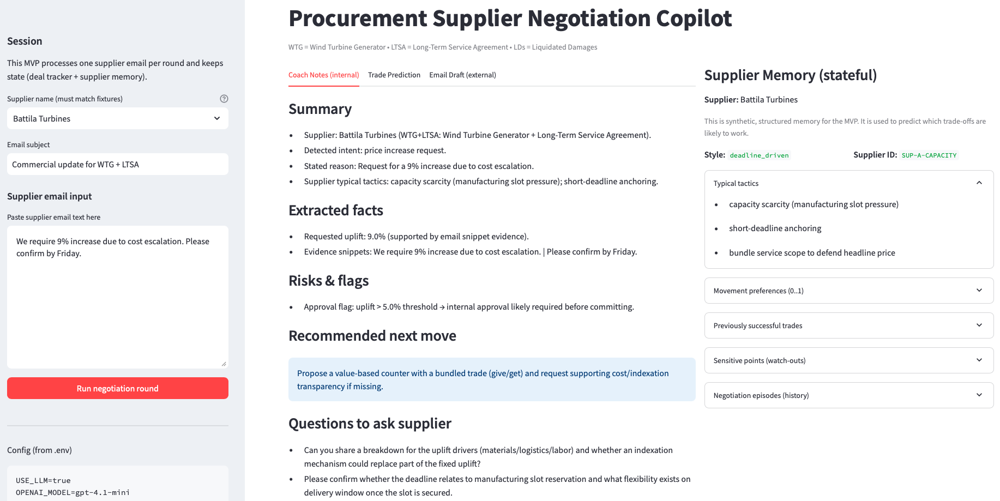
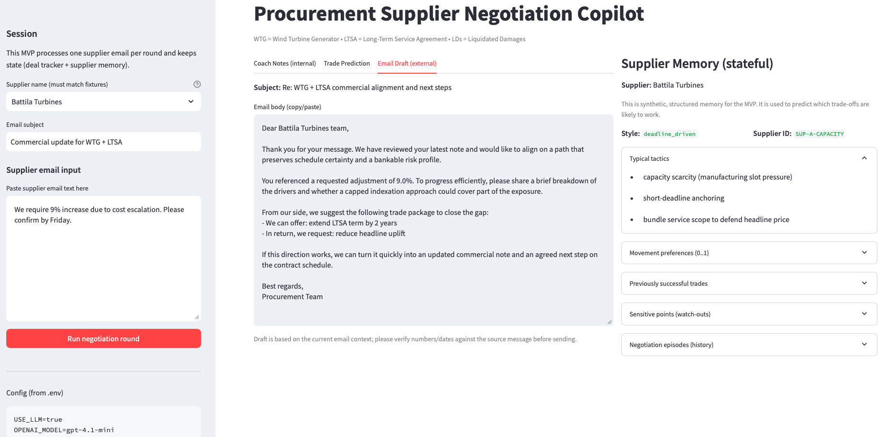

## Overview of Business Problem 

Procurement supplier negotiations are often:

- long-running (weeks or months)
- multi-dimensional (price, schedule, warranty, risk allocation)
- history-dependent (what worked with this supplier before matters)
- policy-constrained (approval thresholds, legal boundaries)

In practice, procurement specialists spend significant time:

- interpreting supplier emails
- recalling past negotiations
- deciding which lever to pull next
- drafting consistent, policy-safe responses
- tracking concessions across rounds

This project addresses those pain points by providing a negotiation copilot that:

- turns unstructured supplier emails into structured negotiation state
- remembers supplier-specific behavior and historical outcomes
- recommends value-based trade-offs (give/get)
- flags approval and compliance risks early
- drafts professional, ready-to-send counter-emails

The result is faster, more consistent, and more defensible negotiations, without replacing human decision-making.

## Supplier Data Usage

All supplier data used in this project is artificially generated and fully synthetic. The supplier profiles, negotiation histories, tactics, and outcomes are deliberately designed to resemble realistic procurement scenarios (WTG supply and LTSA negotiations) without referencing or reproducing any real companies, contracts, or commercial terms. This synthetic data is used solely to demonstrate agentic reasoning, stateful memory, and negotiation patterns.

## High-level pipeline

The agent processes one negotiation round per supplier email:
1.	Supplier email is ingested (free text)
2.	Intent is classified (e.g. price increase, deadline pressure, contract redline)
3.	Key facts are extracted (uplift %, deadline signals, requested terms)
4.	Supplier memory is loaded (historical patterns, movement preferences)
5.	Trade options are predicted using deterministic logic
6.	Internal coach notes are generated
7.	A policy-safe email draft is produced
8.	The updated deal state is persisted for the next round

This pipeline is orchestrated using LangGraph.

## Why this is agentic (not just a chatbot)

Key agentic properties:

1. Persistent state
   
Each negotiation has a durable DealState that evolves across rounds.

2. Long-term memory
   
Each supplier has structured SupplierMemory capturing:
- negotiation style
- typical tactics
- historical outcomes
- levers they tend to move on
  
3. Goal-directed reasoning

The agent does not just respond to emails; it plans the next negotiation move.

4. Deterministic decision logic

Trade predictions and policy checks are rule-based and explainable.

5. Bounded LLM usage

The LLM is used for:
- language understanding (classification, extraction)
- natural-language drafting

In short: the LLM writes and reads; the agent reasons and remembers.

## Architecture overview

- Python 3.11
- Pydantic v2 for schemas and validation
- LangGraph for stateful orchestration
- Streamlit for a compact, explainable UX
- Local JSON fixtures for supplier memory (synthetic, auditable)
- JSONL state store for negotiation history

## Quick start

1.	Clone the repository
2.	Create and activate a virtual environment
3.	Install dependencies

```pip install -r requirements.txt```

4.	Copy environment template

```cp .env.example .env```

5.	Add your OpenAI API key to .env
6.	Run the app

```streamlit run streamlit_app/Home.py```

## Example use case

Supplier email:
“We require a 9% increase due to cost escalation. Please confirm by Friday.”

The copilot:

- detects a price increase request with deadline pressure
- extracts the 9% uplift with evidence
- loads the supplier’s historical behavior
- identifies that this supplier typically anchors high and moves on service scope or indexation
- flags that internal approval is required
- recommends a value-based counter
- drafts a professional reply requesting cost transparency and proposing a trade

The procurement specialist remains in control, but with clear context, memory, and instant trade options overview.


<br><br>

